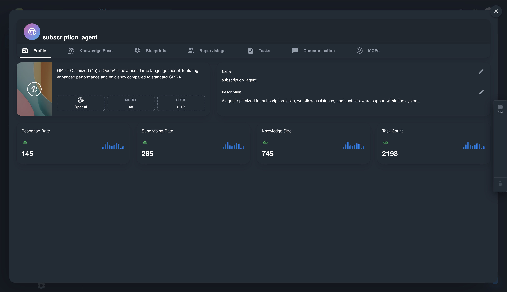
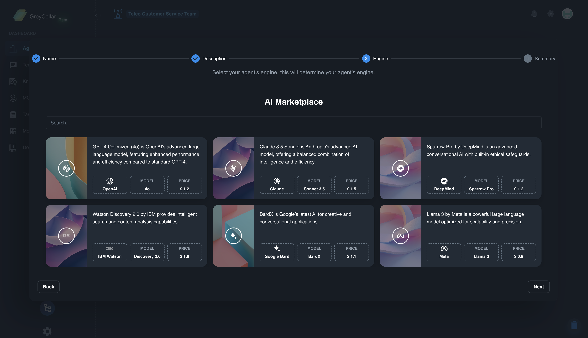

Agent is an AI assistant that performs tasks based on its blueprints and knowledge.

- **Name**: The name of the agent.
- **Icon**: The icon representing the agent.
- **Description**: A description of the agent's purpose and behavior.

## AI Engine

Each agent can be run on a different AI engine, which can be configured in the settings. Even within the same team, different agents can use different AI engines.

> :warning: Even though agents share the same team knowledge base, the platform manages embeddings per AI engine so each agent can effectively utilize the knowledge base.

# Agent Wizard

import ReactPlayer from "react-player";

  <ReactPlayer
    url={require("./agentWizard.mp4").default}
    width={"100%"}
    height={"100%"}
    controls
    loop
    playing={true}
  />

The Agent Wizard is a guided process to create a new agent. It helps you set up the agent's name, icon, description, and AI engine.
