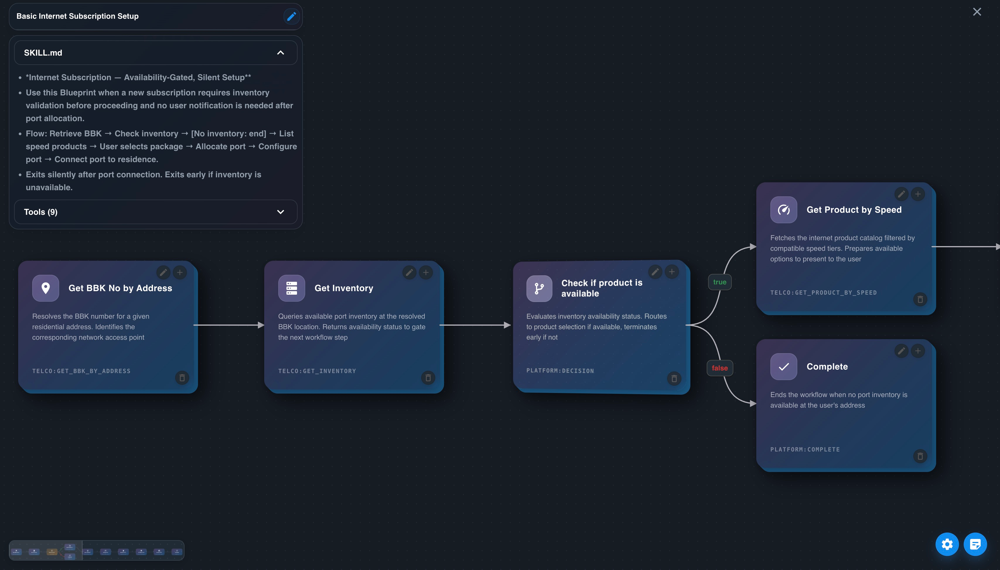
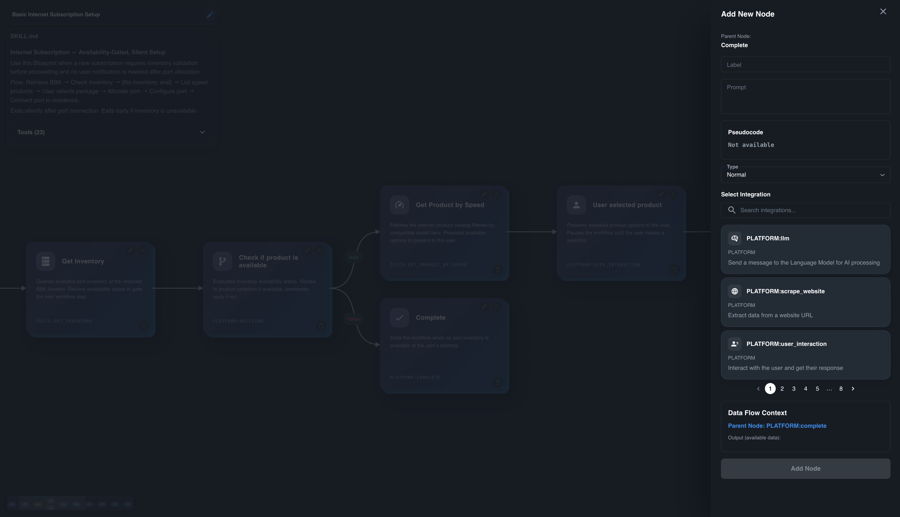
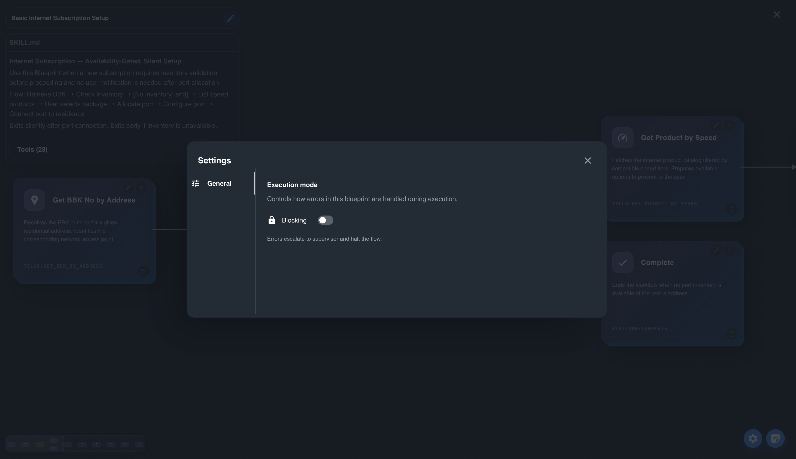

Each AI agent is assigned a set of blueprints that define the tasks it can perform. A blueprint is the structured execution plan that the AI follows based on its knowledge. It outlines what the AI can do and how it can assist you, including a flow of nodes that represent the task execution logic.

## Add Blueprint

To add a new blueprint, you can use the "Add Blueprint" button. This will open a separate chat that allows you to define the blueprint in detail. The AI may ask additional questions to clarify the blueprint and ensure that it is well-defined.

## Blocking

Blueprints have a `blocking` property. When `blocking` is enabled, the agent will wait for human supervision before proceeding with a task step. This is the core mechanism for human-in-the-loop control.
