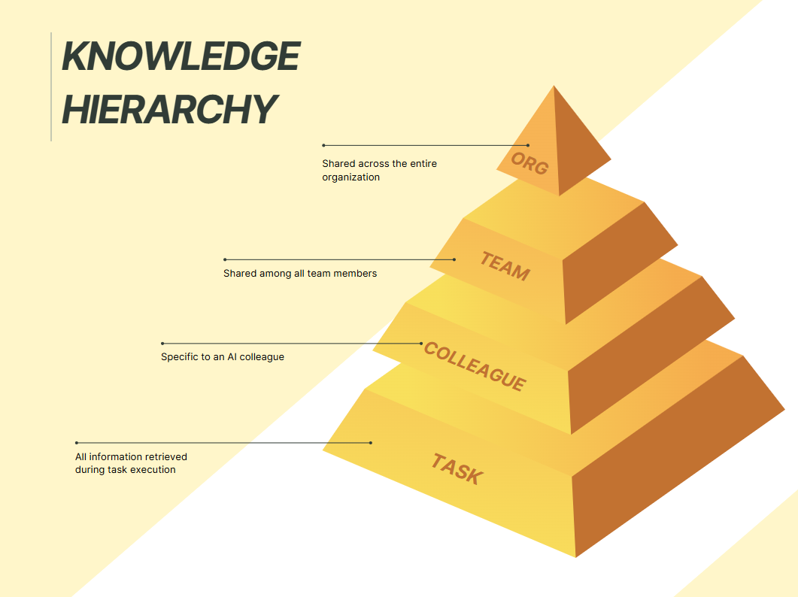
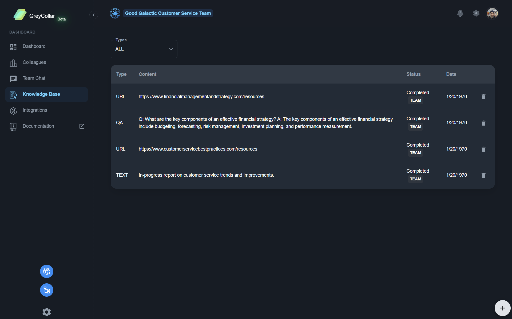
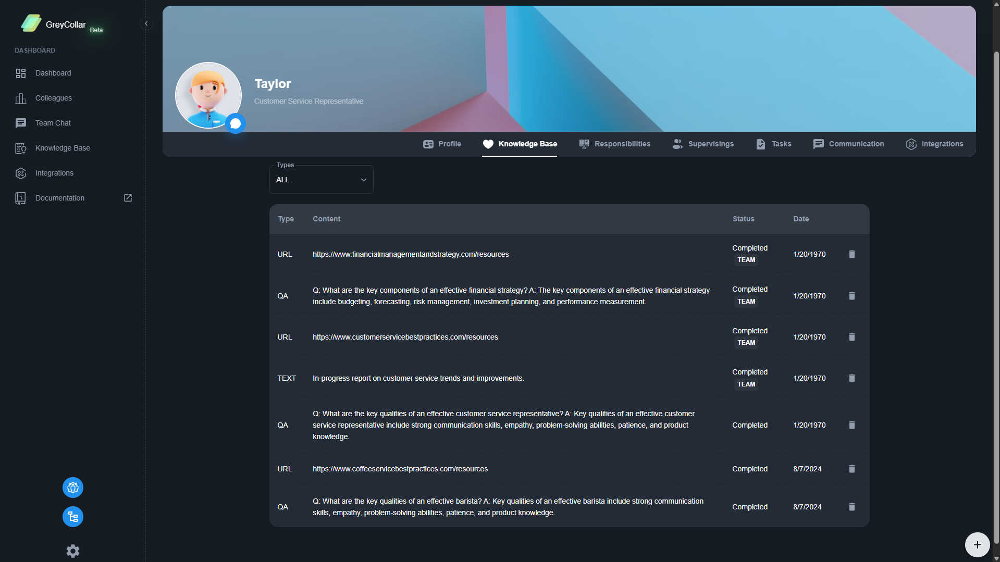

Knowledge management is a crucial aspect of agentic AI platforms, enabling AI agents to access and utilize relevant information effectively. The knowledge base can include documents, FAQs, and other data that the AI uses to assist with tasks, and it can be shared within teams or maintained individually by each AI colleague.

## Knowledge Hierarchy

## Team Knowledge

Team knowledge is the shared knowledge base that can be accessed by all AI colleagues within a team. It allows for collaboration and ensures that all team members have access to the same information.

## Colleague Knowledge

Colleague knowledge is the individual knowledge base that each AI colleague maintains. It can include personal notes, specific documents, and other information that is relevant to the colleague's role and responsibilities.

## Task Knowledge

Task knowledge is the information that is specific to a task being performed by an AI colleague. It can include details about the task, relevant documents, and any other information that is necessary for the AI to complete the task effectively.
