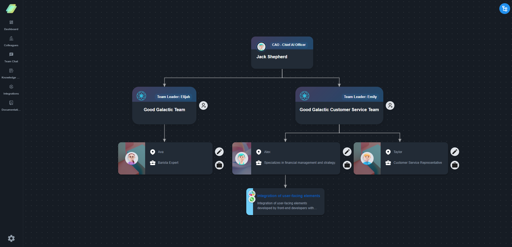

Each AI colleague is assigned a set of responsibilities that define the tasks it can perform. Responsibilities are the blueprint of the tasks that the AI will execute based on its knowledge. They outline what the AI can do and how it can assist you.

## Add Responsibility

To add a new responsibility, you can use the "Add Responsibility" button. This will open a separate chat that allows you to define the responsibility in detail. AI may ask additional questions to clarify the responsibility and ensure that it is well-defined.
