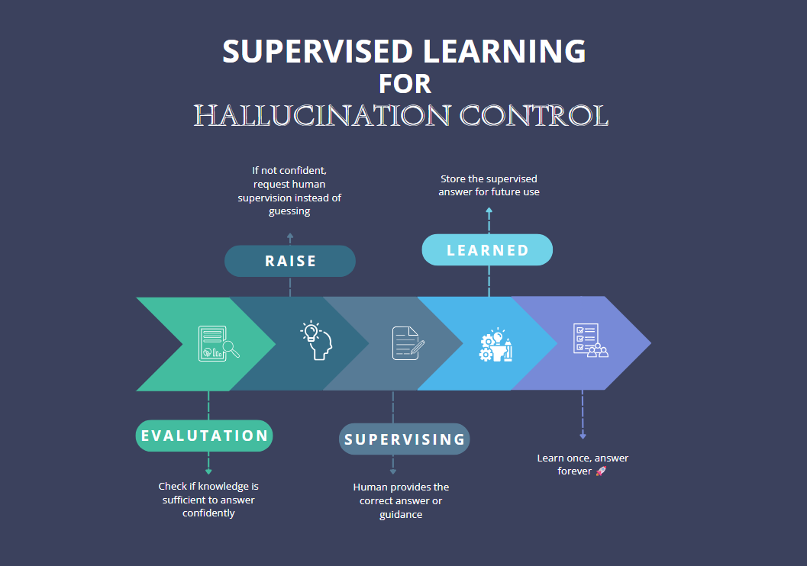

GreyCollar platform solves LLMs hallucination problem by introducing a human-in-the-loop approach. The platform predicts chances of hallucination based on the task and knowledge, and if the chance is high, it raises a supervising task. It allows human supervisors to oversee AI tasks, provide feedback, and ensure that the AI is working correctly. This approach helps to eliminate hallucinations and ensures that the AI is working as intended.

> :warning: Supervising is the core concept to eliminate hallucination, as the AI evaluates knowledge that existed before the execution of the task.

## Supervising Process

1. While AI is executing a task, it may encounter situations where its knowledge is insufficient
2. In such cases, the AI will raise a supervising task
3. The supervising task will be assigned to a human supervisor via e-mail or notification in the platform
4. The supervisor can provide feedback, ask questions, or give additional information to help the AI complete the task

