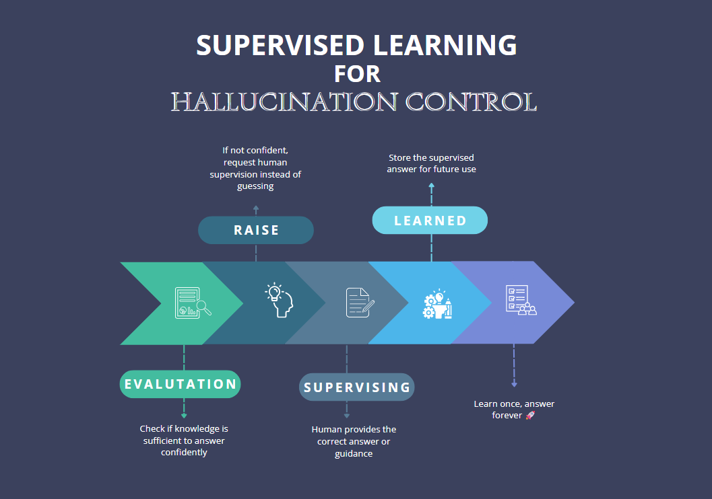

GreyCollar platform solves LLMs hallucination problem by introducing a human-in-the-loop approach. The platform predicts chances of hallucination based on the task and knowledge, and if the chance is high, it raises a supervising task. It allows human supervisors to oversee AI tasks, provide feedback, and ensure that the AI is working correctly. This approach helps to eliminate hallucinations and ensures that the AI is working as intended.

> :warning: Supervising is the core concept to eliminate hallucination, as the AI evaluates knowledge that existed before the execution of the task.

## Supervising Process

1. While AI is executing a task, it may encounter situations where its knowledge is insufficient
2. In such cases, the AI raises a supervising request and the task step pauses at `SUPERVISED_NEEDED`
3. The supervisor is notified via e-mail or platform notification
4. The supervisor responds — the task resumes automatically from where it left off

---

## Two Ways to Respond

### 1. Chat Response

The supervisor answers the question directly in the chat or supervising interface. This resolves the specific question for the current task and the agent immediately continues execution.

> Optionally, the answer can be saved to the knowledge base so the agent learns from it for future tasks.

### 2. Blueprint Modification

The supervisor updates the blueprint that the task is running against. This is the more powerful approach:

- The **current supervised task resumes** from where it paused, using the updated blueprint logic
- **All future tasks** created with that blueprint will also benefit from the change

This method is preferred when the supervising reveals a structural gap in the blueprint — not just a one-off question, but something that should be fixed for every future execution.

